# BuildKit frontend for Gosh

## Architecture



## Build buildkit frontend for Gosh

```bash
go mod vendor
docker build -f Dockerfile -t buildkit-gosh .
docker push buildkit-gosh
```

or for custom docker registry:

```bash
go mod vendor
docker build -f Dockerfile -t my-reg-url:5000/buildkit-gosh .
docker push my-reg-url:5000/buildkit-gosh
```

## Build an image from Gosh

1. Setup environment variables with your wallet

```bash
export WALLET=0:...
export WALLET_PUBLIC=...
export WALLET_SECRET=...
```

1. Write dockerfile.yaml (this specification is far from complete, think of it as a proof of concept)

```yaml
# syntax=buildkit-gosh
## or for custom registry
# syntax=my-reg-url:5000/buildkit-gosh

apiVersion: 1
image: bash:latest
steps:
  - name: print date
    run:
      command: ["/usr/local/bin/bash"]
      args:
        - -c
        - >-
          (date +'%s %H:%M:%S %Z'; echo "Hi there") | tee /message.txt
      # here will be gosh mounts (WIP)
```

1. Now build an image

```bash
# run buildkitd containered
docker run -d --name buildkitd --privileged moby/buildkit:latest
# build image
buildctl --addr=docker-container://buildkitd build \
        --frontend gateway.v0 \
        --local dockerfile=. \
        --local context=. \
        --opt source=buildkit-gosh \
        # or --opt source=my-docker-reg:5000/buildkit-gosh \
        --opt filename=dockerfile-for-gosh.yaml \
        # TODO: not implemented yet
        # --opt wallet="$WALLET" \
        # --opt wallet_secret="$WALLET_SECRET" \
        # --opt wallet_public="$WALLET_PUBLIC" \
        --output type=image,name=my-target-super-image,push=true
```

Here we parameterize the image build process with our wallet credentials.

1. Sign the image (WIP: will be automatical i nrelease)

```bash
# add a label WALLET_PUBLIC to the image
echo "FROM my-target-super-image:latest" | docker build --label WALLET_PUBLIC=$WALLET_PUBLIC -t "my-target-super-image-signed" -

export IMAGE_SHA='sha256:111...11'

# build content-signature image
(cd ../content-signnature; docker build -t content-signature .)

# my-target-super-image's sha256

docker run --rm -ti content-signature sign \
    -n <block_chain_net_url e.g. https://gra01.net.everos.dev>
    -g $WALLET \
    -s $WALLET_SECRET \
    $IMAGE_SHA
```

Now we have signed the image!

We can check the image signature with our public key

```bash
docker run --rm -ti content-signature check\
    -n <block_chain_net_url e.g. https://gra01.net.everos.dev>
    $WALLET_PUBLIC \
    $IMAGE_SHA
```
