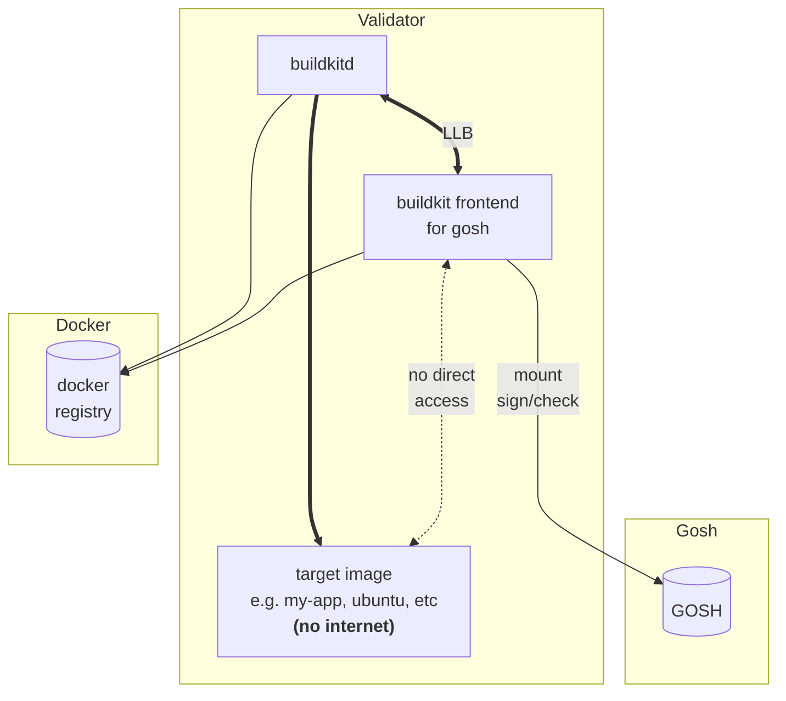

# BuildKit frontend for Gosh

## Architecture

```mermaid
flowchart TB
    subgraph validator[Validator]
        target["
            target image
            e.g. my-app, ubuntu, etc
            <b>(no internet)</b>
        "]
        frontend["
            buildkit frontend
            for gosh
        "]
        buildkit["
            buildkitd
        "]
    end
    subgraph gosh_team[Gosh]
        G[(GOSH)]
    end

    subgraph docker_team[Docker]
        reg[("
            docker
            registry
        ")]
    end

    buildkit --> reg
    frontend --> reg
    buildkit ==> target
    buildkit <==> |LLB|frontend
    frontend <-..-> |"
        no direct
        access
    "|target

    frontend --->|"
        mount
        sign/check
    "| G

```
